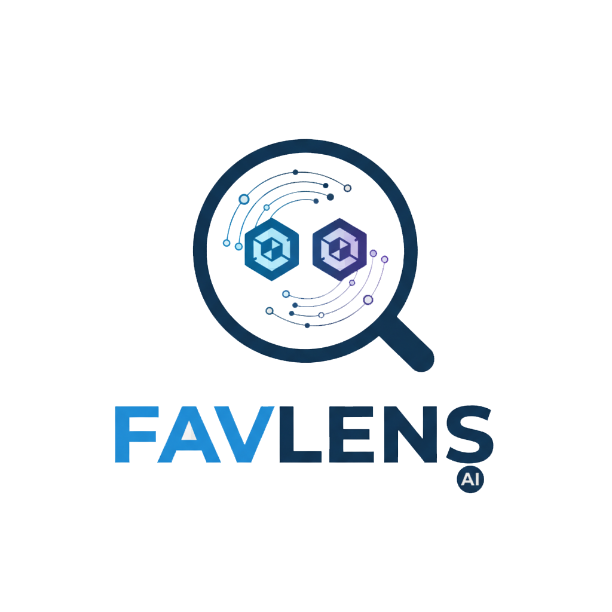

<h1 align="center">
  <br>
  
  <br>
  favlens — Favicon Similarity Scanner
</h1>

<p align="center">
  <a href="https://github.com/ethicalhackingplayground/favlens">
    
  </a>
  <a href="https://github.com/ethicalhackingplayground/favlens/blob/master/LICENSE">
    
  </a>
  <a href="https://goreportcard.com/report/github.com/ethicalhackingplayground/favlens/v2">
    
  </a>
  <a href="https://pkg.go.dev/github.com/ethicalhackingplayground/favlens/v2">
    
  </a>
</p>

---

## Overview
Favicon similarity scanner powered by local vision models via Ollama. favlens compares site favicons against a base reference and reports matches, helping you expand your attack surface to find sites with similar or identical favicons.

This is a recon-focused utility that helps validate which assets belong to your targets by using AI vision to find favicon and logo similarities across domains. It supports asset discovery, brand mapping, and reduces false positives through image-based matching.

## Features
- Concurrent workers for faster scans on large URL lists
- Flexible logging modes: debug, verbose, and silent
- Save matched URLs to a file for downstream processing

## Prerequisites
- Go 1.21+
- Ollama installed and running (https://ollama.com/)
- A vision-capable Ollama model available locally (examples: `gemma3:4b`, `llava:7b`, `moondream`, `bakllava`)

Example to pull a model:
```
ollama pull gemma3:4b
```

## Install
```
go install -v github.com/ethicalhackingplayground/favlens/v2/cmd/favlens@latest
```
On Windows, the binary will be `favlens.exe`.

## Usage
Basic usage:
```
favlens -base https://example.com/favicon.ico -file urls.txt
```

CLI flags:
- `-base` string  
      Base favicon URL to compare against (required)
- `-debug`  
      Enable debug logging (shows everything)
- `-delay` int  
      Delay between requests in milliseconds (default: 0)
- `-file` string  
      Path to file containing URLs to check (required)
- `-model` string  
      Ollama model to use (default: gemma3:4b) (default "gemma3:4b")
- `-o` string  
      Output file to save matched URLs (optional)
- `-ollama-host` string  
      Ollama host (default: http://localhost:11434) (default "http://localhost:11434")
- `-silent`  
      Silent mode (only shows matched URLs)
- `-timeout` int  
      HTTP timeout in seconds (default: 30) (default 30)
- `-verbose`  
      Enable verbose logging (shows info without errors)
- `-workers` int  
      Number of concurrent workers (default: 5) (default 5)

## Methodology
favlens helps map assets for a target by finding domains whose favicons are identical or visually similar to a known base favicon. This is useful for expanding visibility around a brand or organization.

Example reference pair:
- `https://bmwstocklocator.net/favicon.ico`
- `https://bmw.com/favicon.ico`
These may not be identical, but they can be visually similar.

### 1) Generate TLDs
Use a small Go program to stream all TLDs:
```go
package main

import (
  "fmt"
  "github.com/picatz/tlds"
)

func main() {
  for domain := range tlds.StreamAllDomains() {
    fmt.Println(domain)
  }
}
```
Run it and save to a file:
```
go run tlds.go > tlds.txt
```

### 2) Build candidate root domains
Concatenate a base label with each TLD to produce roots (example for `bmw`):
```
cat tlds.txt | xargs -P10 -I@ bash -c 'echo "bmw@"' > roots.txt
```
This yields candidates like `bmw.com`, `bmw.net`, `bmw.org`, etc.

### 3) Resolve candidate domains and collect responsive hosts
Use dnsresolver to check ports and resolve candidates, then collect unique responsive hosts:

Repository: https://github.com/ethicalhackingplayground/dnsresolver
```
cat roots.txt | dnsresolver -p 80,443 -c 100 -r 100 --resolvers resolvers.txt | anew hosts.txt
```
- `-p 80,443` checks HTTP/HTTPS
- `-c 100` sets concurrency
- `-r 100` sets resolution rate
- `anew` appends only new lines to `hosts.txt`

### 4) Compare favicons with favlens
Feed collected hosts into favlens with your base favicon:
```
favlens -base https://www.bmw.com/favicon.ico -file hosts.txt -model gemma3:4b -o found.txt -verbose
```
- `-verbose` shows progress without debug noise
- `-o found.txt` stores matched URLs for later analysis

Notes:
- Adjust concurrency and resolver settings to suit network policy and rate limits.
- Use the `-silent` mode when you only need matched URLs.

## Examples
Compare using defaults and save matches:
```
favlens -base https://example.com/favicon.ico -file urls.txt -o matched.txt
```
Increase concurrency and use a different model:
```
favlens -base https://example.com/favicon.ico -file urls.txt -workers 10 -model gemma3:4b
```

## ☕ Support the Project
If you get a bounty using this tool, consider supporting by buying me a coffee!

<p align="center">
  <a href="https://buymeacoffee.com/zoidsec" target="_blank">
    
  </a>
</p>
